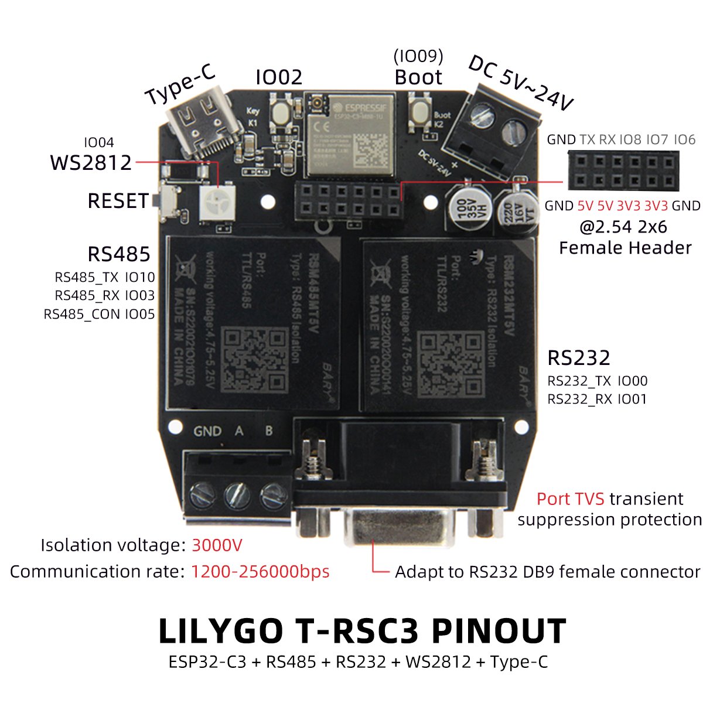

<h1 align = "center">🌟LILYGO T-RSC3 & RSS3 🌟</h1>

<h3 align = "left">Quick start:</h3>

**USE Arduino IDE**

1. Install the current upstream Arduino IDE at the 1.8 level or later. The current version is at the [Arduino website](http://www.arduino.cc/en/main/software).
2. Start Arduino and open Preferences window. In additional board manager add url: https://raw.githubusercontent.com/espressif/arduino-esp32/gh-pages/package_esp32_index.json .separating them with commas.
3. Copy all folders in [lib folder](./lib/)  to Arduino library folder (e.g. C:\Users\YourName\Documents\Arduino\libraries)
4. Open ArduinoIDE  ,`Tools` , Look at the picture to choose
   

**USE PlatformIO**

1. Install [Visual Studio Code](https://code.visualstudio.com/) and [Python](https://www.python.org/)
2. Search for the `PlatformIO` plugin in the `VisualStudioCode` extension and install it.
3. After the installation is complete, you need to restart `VisualStudioCode`
4. After restarting `VisualStudioCode`, select `File` in the upper left corner of `VisualStudioCode` -> `Open Folder` -> select the `T-RSC3` directory
5. Wait for the installation of third-party dependent libraries to complete
6. Click on the `platformio.ini` file, and in the `platformio` column
7. Uncomment one of the lines `src_dir = xxxx` to make sure only one line works
8. Change `default_envs` to the corresponding board
9. Click the (✔) symbol in the lower left corner to compile
10. Connect the board to the computer USB
11. Click (→) to upload firmware
12. Click (plug symbol) to monitor serial output

<h3 align = "left">Product 📷:</h3>

| Product |                  Product  Link                  |
| :-----: | :---------------------------------------------: |
| T-RSC3  | [LilyGo](https://www.lilygo.cc/products/t-rsc3) |
| T-RSS3  | [LilyGo](https://www.lilygo.cc/products/t-rss3) |

## Pinout

