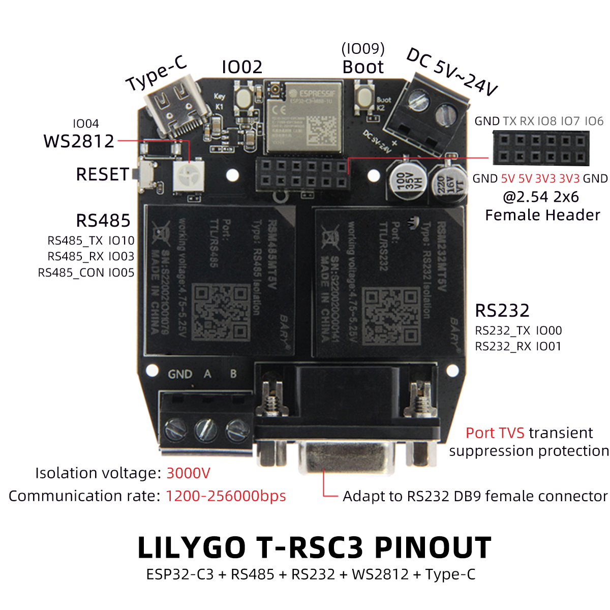

<h1 align = "center">🌟LILYGO T-RSC3</h1>

## **中文 | [English](./README.md)**

<h3 align = "left">快速开始:</h3>

1. 安装1.8以上的[Arduino IDE](http://www.arduino.cc/en/main/software).
2. 打开Arduino IDE 在文件->首选项->附加开发板管理器网站添加 https://raw.githubusercontent.com/espressif/arduino-esp32/gh-pages/package_esp32_index.json .最后用以逗号隔开。(由于这个网站服务器在国外，可能比较慢或者不成功。也可以参考[LilyGo-Document](https://github.com/Xinyuan-LilyGO/LilyGo-Document)来搭建)
3. 选择"工具"->开发板 -> ESP32C3 Dev Module
5. 需要安装的库
     - [ModbusMaster](https://github.com/4-20ma/ModbusMaster)
     - [Adafruit_NeoPixel](https://github.com/adafruit/Adafruit_NeoPixel)
     - [ESPAsyncWebServer](https://github.com/me-no-dev/ESPAsyncWebServer)
     - [WebSerial](https://github.com/ayushsharma82/WebSerial)

<h3 align = "left">Product 📷:</h3>

|  Product   | Product  Link |
| :--------: | :-----------: |
| [T-RSC3]() |               |

## Pinout

