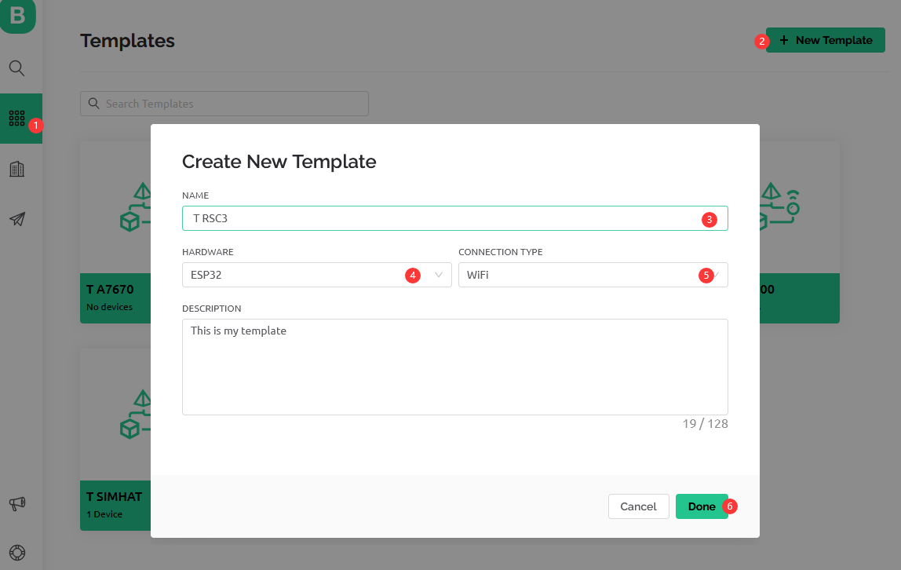
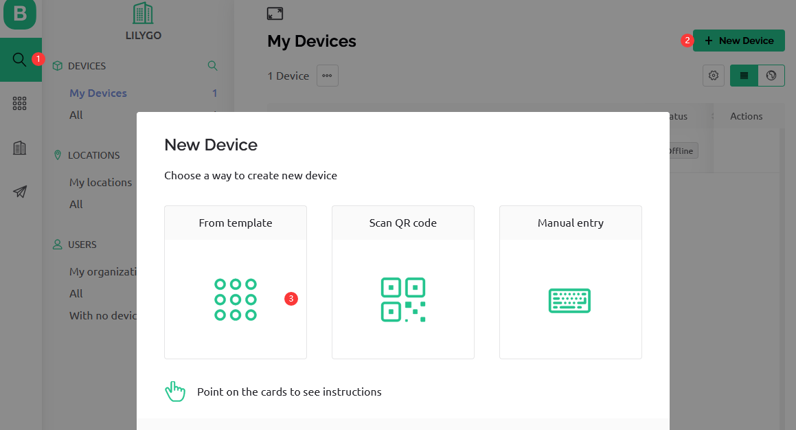
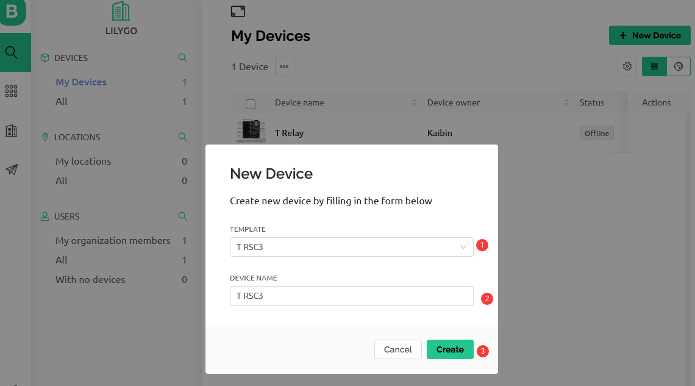
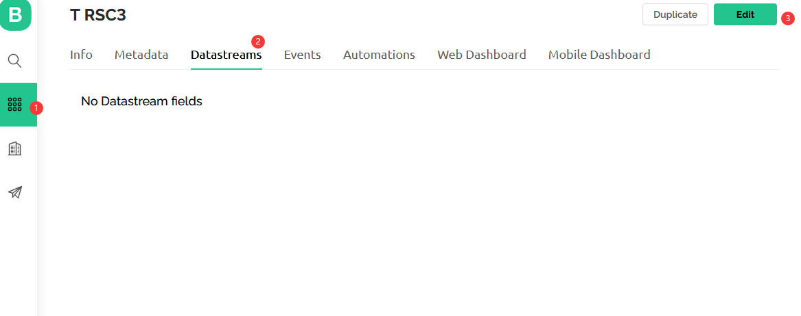
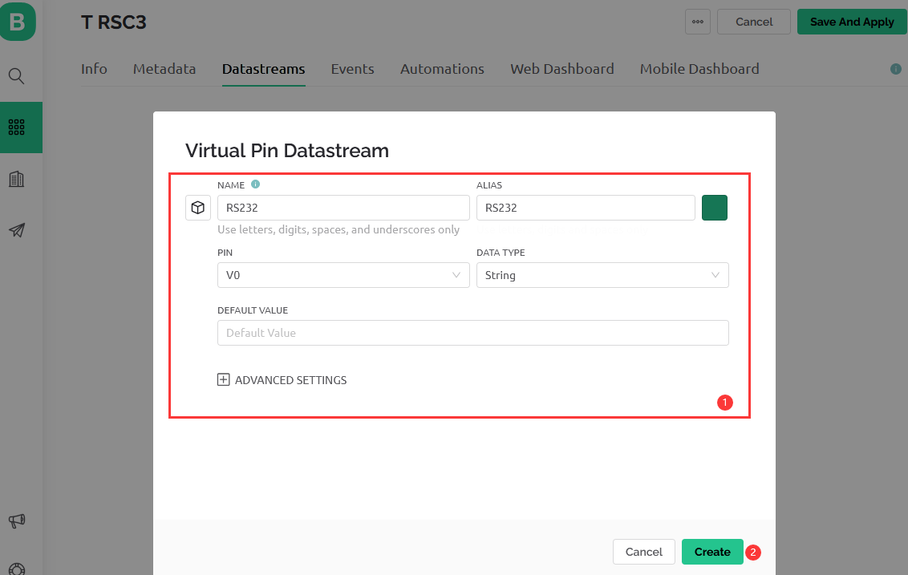
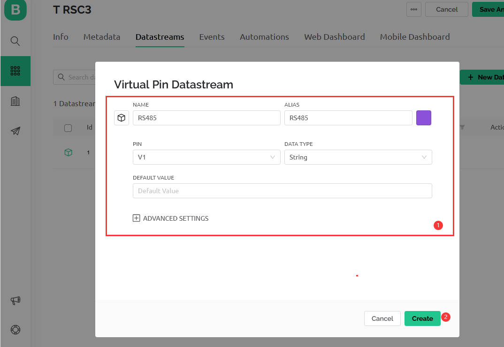
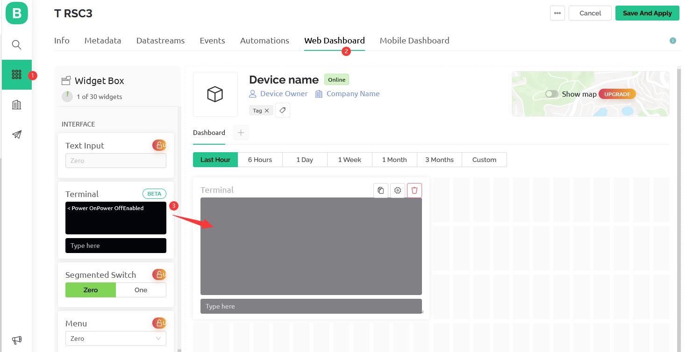
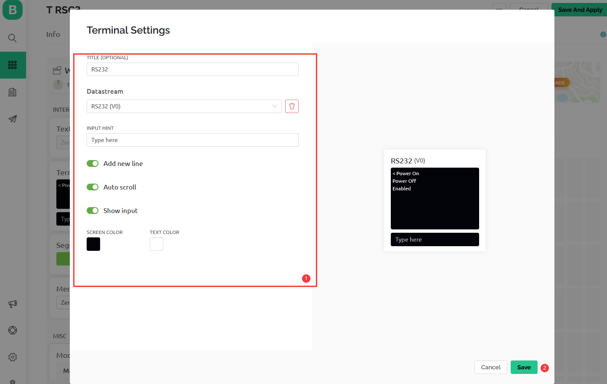
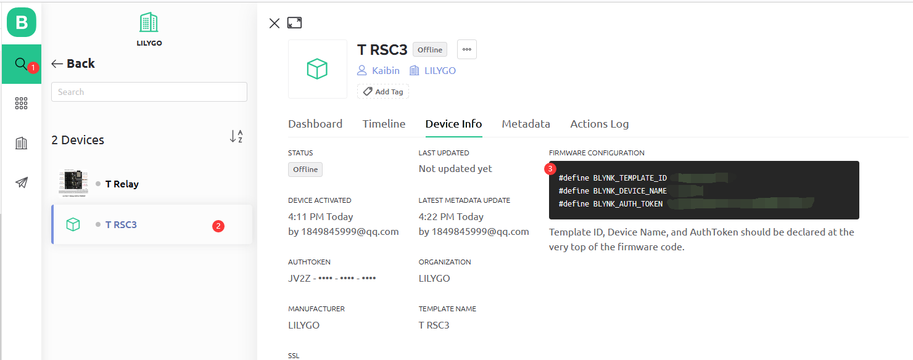

<h1 align = "center">🌟LILYGO T-RSC3🌟</h1>

# Steps:
1. The following dependencies need to be installed
     - [blynk](https://github.com/blynkkk/blynk-library)
     - [TinyGSM](https://github.com/vshymanskyy/TinyGSM)
     - [StreamDebugger](https://github.com/vshymanskyy/StreamDebugger)
     - [ArduinoHttpClient](https://github.com/ricemices/ArduinoHttpClient)
     - [ESP32-Arduino-CAN](https://github.com/miwagner/ESP32-Arduino-CAN)

2. Register and login to [blynk.cloud](https://blynk.cloud/dashboard/login)
3. Create a new template or use an existing template (the name can be customized)

  

4. When the Template is ready, go to Search -> Devices - Create New Device

  

5. Configuration module

  

  

  

  

6. Set up the Web dashboard 

  

  

  


7. Replace the macro definition in the code

    ```
    #define BLYNK_TEMPLATE_ID "" 
    #define BLYNK_DEVICE_NAME "" 
    #define BLYNK_AUTH_TOKEN ""
    ```

   

8. Upload the code. Now you can send the data and fetch it in the cloud
   1. Press key K1(IO0) to switch the RS485 mode
   2. RS485 can send data directly on the serial port
   3. RS232 needs to add the prefix "RS232" to send (you can customize the prefix by modifying the value of rs232_prefix_str). To send `123` over RS232, enter `RS232 123`. The space in between is required.

## Blynk References

1. [Getting Started Guide](https://www.blynk.cc/getting-started)
2. [Documentation](https://docs.blynk.io/en/blynk.apps/overview)
3. [Sketch generator](https://examples.blynk.cc/)
